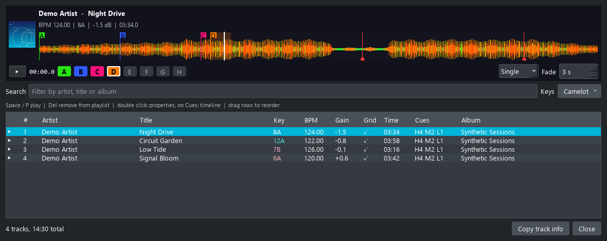
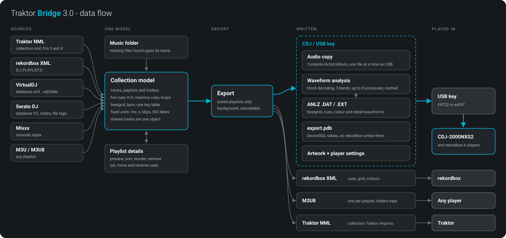
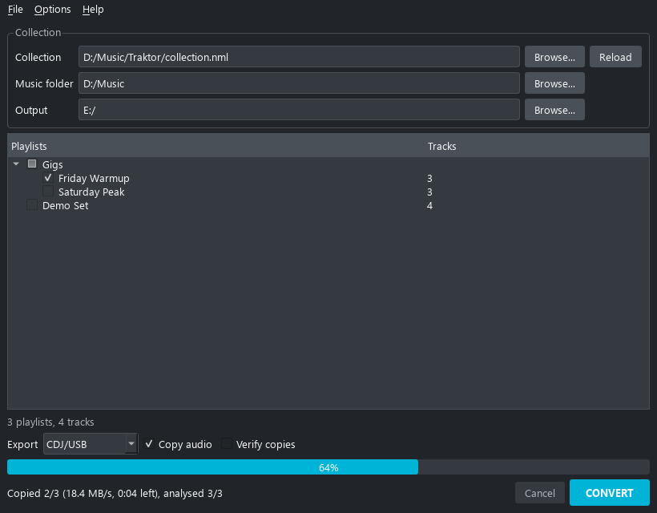
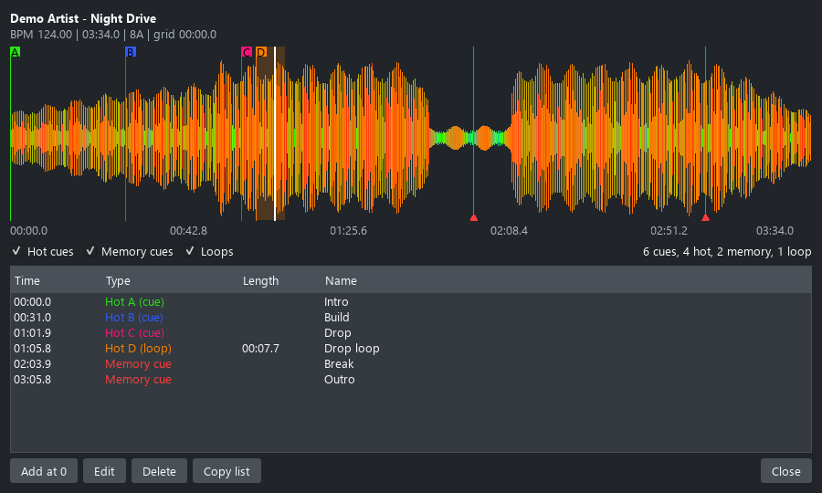

# Traktor Bridge 3.3

[](https://ko-fi.com/bsm3d)

Traktor Bridge puts your DJ collection on a Pioneer CDJ. It reads Traktor, rekordbox XML,
VirtualDJ, Serato, Mixxx and M3U playlists, and writes a USB key the player reads as if
rekordbox had made it: playlists, hot cues, loops, beatgrid, keys, waveforms and artwork. It
also exports to rekordbox XML, M3U8 and Traktor NML.

Website and user guide: [www.traktorbridge.com](https://www.traktorbridge.com)



## Why

I have played with Traktor for more than twenty years and I keep running into CDJ booths. I
wanted a simple tool, easy to use on any operating system, to take my playlists to those
players. DJs who paid for their CDJs should be able to play the playlists they sometimes built
over years in another program, without redoing them. The newer open library formats do not help the CDJ-2000NXS2, which
does not support them. Traktor Bridge writes the key directly from the collection you already
have, cue points included, so you don't spend hours redoing them.

The name comes from the first version, which only read Traktor. It is not tied to any DJ
software anymore: you can start from a plain M3U playlist, set your cues in Traktor Bridge,
sort the tracks and choose their order.

## How it works



Every source is read into one model: tracks, playlists, cues, loops, beatgrid and keys, in the
same units whatever the software they came from. Missing files are found again in your music
folder, and what you change in the playlist details is kept. The export then writes the CDJ
USB key (audio, waveform analysis, ANLZ files, export.pdb, artwork) or a rekordbox XML, M3U8 or
Traktor NML file.

## Download

**Windows, portable**: download `TraktorBridge-3.3-win64.zip` from the
[releases](https://github.com/bsm3d/Traktor-Bridge/releases/latest), unzip it anywhere and run
`TraktorBridge.exe`. No installer, settings and log are written next to the program.

## Using it

1. File > Open collection (Ctrl+O): a Traktor `collection.nml`, a rekordbox XML, VirtualDJ
   `database.xml`, Serato `_Serato_/database V2`, `mixxxdb.sqlite` or an M3U / M3U8.
2. If your files moved since the collection was written, set the music folder: missing tracks
   are looked up there by file name.
3. Tick the playlists to export, nothing ticked exports everything.
4. Pick the format and the output, then Convert.



Double click a playlist to check it before exporting: preview player with the waveform and cue
pads, sort, filter, drag to reorder, Del to remove a track, and a cue timeline to move, rename
or delete cues. What you change there goes into the export.



## Formats

| Source | Read |
| --- | --- |
| Traktor NML (Pro 3 and 4) | cues, loops, grid, key, rating, colour, smartlists listed |
| rekordbox XML | position marks, tempo anchor, colours |
| VirtualDJ `database.xml` | hot cues, saved loops, beatgrid, `.m3u` and `.vdjfolder` playlists |
| Serato DJ `_Serato_/database V2` | crates, cues, loops and beatgrid from the file tags |
| Mixxx `mixxxdb.sqlite` | playlists, crates, cues, keys |
| M3U / M3U8 | the files, artist and title |

| Export | Written |
| --- | --- |
| CDJ/USB | `Contents/`, `PIONEER/rekordbox/export.pdb`, ANLZ analysis, artwork, player settings |
| rekordbox XML | for File > Import in rekordbox |
| M3U8 | one file per playlist, folders kept |
| Traktor NML | a collection Traktor can import |

## CDJ keys

A CDJ key needs a few files only rekordbox writes: the player settings and the pages describing
the player menus. Traktor Bridge does not ship them. Export any playlist to a USB key with your
own rekordbox once, then import that key in Options > CDJ (Traktor Bridge also asks at the first
CDJ export). The files are reused for every key after that.

Format the key FAT32 or exFAT, the players show NO DISK on NTFS. Export to the root of the key,
or to an empty folder you copy to the root: `Contents` and `PIONEER` sit side by side at the
top.

The export works on the CDJ-2000NXS2: loading, browsing, playback, waveforms, beatgrid, cues
and artwork. Players reading rekordbox 6 USB exports should read it too, the CDJ-3000 without
its HD waveforms.

The analysis runs on several cores in parallel, it is cached, and files already on the key are
not copied again. On a USB key the audio is copied one file at a time and the progress shows
the speed and the time left: with a slow key, writing the audio takes longer than everything
else.

Every export also writes `traktor_bridge_checksums.json` at its root: the size and SHA-256 of
each file written. File > Verify an export reads the key back and lists anything damaged or
missing, handy before a gig. With Verify after export ticked, the check runs right after the
export and the copies that differ from their source are written again.

## Command line

```bash
TraktorBridge.exe --export COLLECTION OUTPUT [--format FORMAT] [--music FOLDER] [--reference KEY]
TraktorBridge.exe --verify OUTPUT
```

`--reference` imports the player files from a key exported by rekordbox, once. FORMAT is `CDJ/USB` (default), `Rekordbox XML`, `M3U` or `Traktor NML`. The report goes to
`traktor_bridge.log`, the exit code is 0 when nothing failed. `--verify` checks an export
against its checksums and exits with 1 when a file is damaged or missing. The exe has no console, use
`start /wait` from a prompt.

## For developers

The program is free to download, its source code is not published. How it is built and what I know about the formats, the Pioneer USB export above all, is in
[developers/DOCUMENTATION.md](developers/DOCUMENTATION.md), along with the research method
behind it.

## Author

Benoit (BSM) Saint-Moulin: [benoitsaintmoulin.com](https://www.benoitsaintmoulin.com),
[bsm3d.com](https://www.bsm3d.com), [github.com/bsm3d](https://github.com/bsm3d),
Instagram [@benoitsaintmoulin](https://www.instagram.com/benoitsaintmoulin).

Traktor Bridge is free and stays free. Tips on [Ko-fi](https://ko-fi.com/bsm3d) help pay for
the website hosting.

## License

[PolyForm Noncommercial 1.0.0](LICENSE): free for personal, educational and any other
noncommercial use, modification included. Commercial use needs my prior authorization, ask
by opening an issue on this repository or through my website. Copies must keep the license and the copyright notice.

## Disclaimer

Pioneer DJ, rekordbox and CDJ are trademarks of AlphaTheta Corporation. Native Instruments and
Traktor are trademarks of Native Instruments GmbH. VirtualDJ is a registered trademark of Atomix
Productions Inc. Serato and Serato DJ are registered trademarks of Serato Limited. Mixxx is the
name of the Mixxx open source project. All other trademarks belong to their respective owners.
Traktor Bridge is independent, not affiliated with or endorsed by any of them, and written for
interoperability.

Provided as is, without warranty. Back up your collection and test a key on your player before
playing out with it.

Thanks to Deep Symmetry (crate-digger, beat-link) for their documentation of the rekordbox
formats, and to the openboxxx project.
