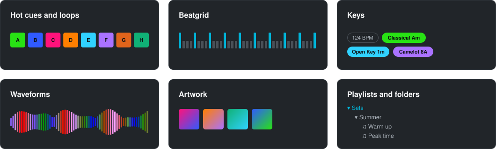
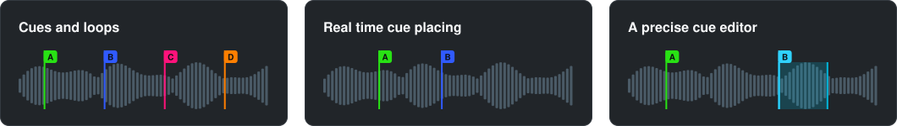
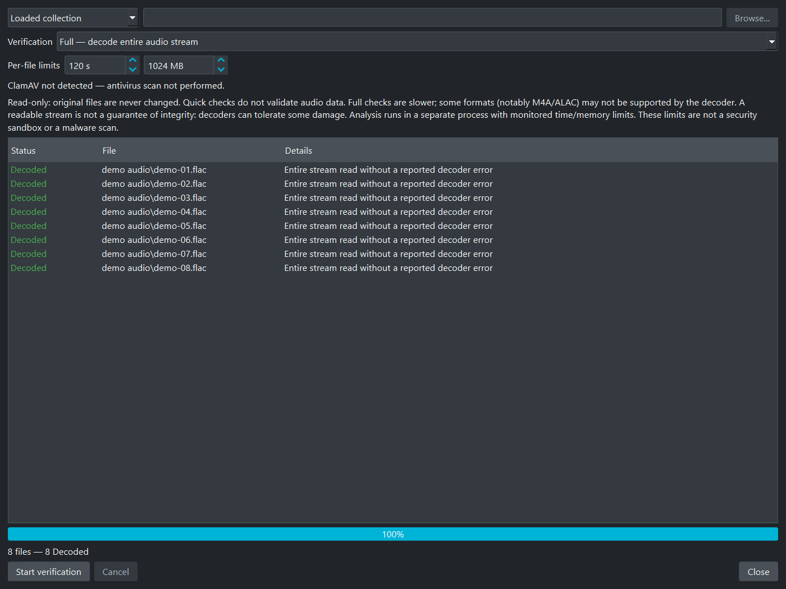
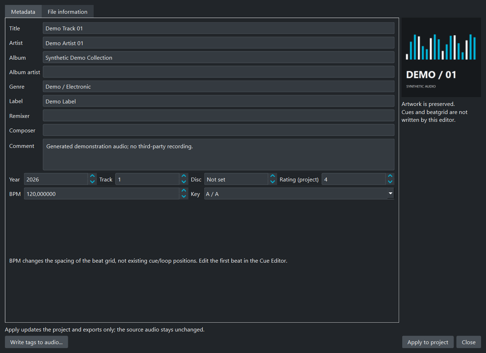
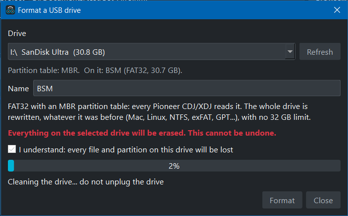
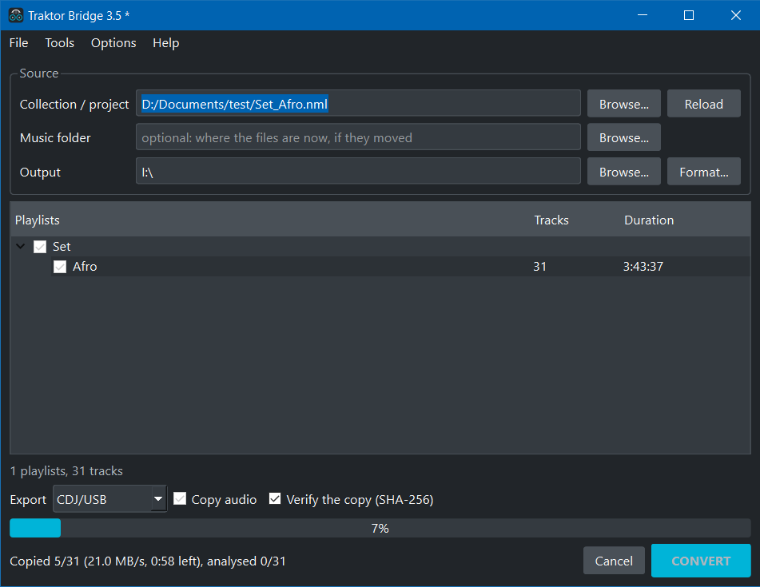

# Traktor Bridge 3.5.1

Traktor Bridge was designed for users of Traktor, the DJ software from Native Instruments.
It is a central hub: the leading DJ programs exchange playlists through it, and with them the
hundreds of hours of work it takes to build those playlists.

It imports your collections into Traktor, and it takes your Traktor collection out to the others.
It is a true Swiss army knife for managing your music.

Traktor Bridge is not a competitor of Traktor. It is not a DJ program, it does not mix, and it
does not replace any of the programs it connects. It works alongside them.

It is written from scratch, in Python, with the help of the research published by
Deep Symmetry (crate-digger, beat-link) and by the openboxxx project.

Take your Traktor playlists to a CDJ, with their cues, loops, beatgrid and artwork.
Or bring a collection from another program into Traktor.

Traktor Bridge reads Traktor, rekordbox XML, VirtualDJ, Serato, Mixxx and M3U.
It writes CDJ USB keys, rekordbox XML, M3U8 and Traktor NML.
You can also build playlists and edit cues without another DJ program.

Website and user guide: [www.traktorbridge.com](https://www.traktorbridge.com)


*Traktor Bridge 3.5 with fictional metadata, synthetic audio and original demo artwork.*

## What it does



Build and reorder playlists, preview tracks, edit metadata, place cues and loops.
Detect a constant-tempo grid, then check it with the waveform and metronome.
Undo/Redo keeps track of playlist edits. Save them as a JSON project.



For CDJ exports, Traktor Bridge copies the audio, writes the database and analysis,
checks the generated files and offers to eject the key.
Analysis is cached; unchanged audio does not need copying again.
The built-in FAT32 formatter handles removable USB/SD drives and erases them after confirmation.

Windows installer and portable build. Windows, macOS and Linux from source.
Free for noncommercial use.

## Safety and validation in 3.5

### Privacy: your library stays with you

Your audio, playlists, cues, metadata and analysis stay on your computer. No uploads, no
telemetry, no account, no automatic log sharing. Loading, editing, analysis, backups and
exports work offline.

Website links open in your browser. If you share a log, it may contain file paths and track
names, so read it first. Antivirus tools and cloud-synced folders have their own privacy settings.

### File checks

Generated Pioneer databases and analysis files are checked before they are published,
then read back with SHA-256. Audio-copy verification is enabled by default.
**Tools > Verify an export** checks the key again later.

Backup restoration checks paths, archive limits and audio hashes. ZIP bombs and unsafe
paths are rejected. A matching checksum proves the bytes are the same, not that the
source can be trusted.

The packaged app checks its own native modules at startup. That is not publisher signing,
and third-party DLLs are not covered. No check protects you from a power cut, a failing
drive or every malicious file.

### ClamAV

The audio-check panel detects **ClamAV** if it is installed. It never runs it and never updates
its signatures. Install and update ClamAV yourself, then scan your music folder outside
Traktor Bridge:

```powershell
clamscan --recursive --infected "D:\Music"
```

This command does not delete files. Exit 0 means no detection, 1 means a detection,
2 means an error. Use the full executable path if `clamscan` is not on PATH.
No antivirus catches everything. Traktor Bridge does not detect MP3 steganography.

**Quit is blocked during writing, analysis and scans.** Wait or use **Cancel**.
Do not unplug the key before completion and safe ejection.
The [documentation](developers/DOCUMENTATION.md) explains the checks and their limits.

## Why

I have used Traktor for more than twenty years. When I play on CDJs, I want my playlists
and cues with me, not another library to rebuild.

I wrote Traktor Bridge for that. The first version only read Traktor, hence the name.
It now reads other collections too, or just an M3U playlist.

## How it works


Collection readers share one model for tracks, playlists, cues, loops, beatgrid and keys.
Edits update that model; the selected exporter writes it to the destination format.

## Download

**Windows, installer (64-bit)**: download `TraktorBridge-3.5.1-setup.exe` from the
[releases](https://github.com/bsm3d/Traktor-Bridge/releases/latest) and run it. It installs for your
user only, no admin rights.

**Windows, portable (64-bit)**: download `Portable_TraktorBridge-3.5.1-win64.zip` from the
[releases](https://github.com/bsm3d/Traktor-Bridge/releases/latest), unzip it anywhere and run
`TraktorBridge.exe`. No installer, settings and log are written next to the program.

**From source**, Windows, macOS or Linux, Python 3.11 or newer:

```bash
pip install -r requirements.txt
python main.py
```

## Using it

1. File > Open project / collection (Ctrl+O): a Traktor `collection.nml`, a rekordbox XML, VirtualDJ
   `database.xml`, Serato `_Serato_/database V2`, `mixxxdb.sqlite` or an M3U / M3U8.
2. If your files moved since the collection was written, set the music folder: missing tracks
   are looked up there by file name.
3. Tick the playlists to export, nothing ticked exports everything.
4. Pick the format and the output, then Convert.


Library screenshots use fictional names, synthetic audio and original artwork.
Formatting and export screenshots show actual operations.

Double-click a playlist to preview tracks, reorder them, edit cues or detect a beat grid.
**S** toggles snap; **A-H** controls hot cues; **Ctrl+Z / Ctrl+Y** undoes and redoes edits.
Save your work with **File > Save the project (Ctrl+S)** before reloading the collection.

**Tools > Verify audio files...** checks headers (Quick) or decodes the stream (Full),
without changing the files. Unsupported files and interrupted checks are marked Not checked.
This is an audio check, not an antivirus scan.



*Full check on eight synthetic audio files.*

**Tools > Backup** saves, verifies and restores playlists with their audio.
Keep the ZIP and its `.zip.sha256` file together. Restore through this panel, into a new folder.

**ID Tag** edits metadata. Apply to project leaves the audio untouched;
Write tags to audio modifies the file and keeps a `.tb-tags.bak` backup.
Undo does not reverse audio-file writes.



Click a track's **Cues** column to open the timeline. Drag cues on the waveform,
edit loops and check the grid with the metronome. Check detected grids by ear before exporting.
M3U8 does not carry cues or beat grids.


*Three hot cues, one memory cue and two loops.*

Full instructions and shortcuts: **Help > Usage** or the [documentation](developers/DOCUMENTATION.md).

## Formats

| Source | Read |
| --- | --- |
| Traktor NML (Pro 3 and 4) | cues, loops, grid, key, rating, colour, smartlists listed |
| rekordbox XML | position marks, tempo anchor, colours |
| VirtualDJ `database.xml` | hot cues, saved loops, beatgrid, `.m3u` and `.vdjfolder` playlists |
| Serato DJ `_Serato_/database V2` | crates, cues, loops and beatgrid from the file tags |
| Mixxx `mixxxdb.sqlite` | playlists, crates, cues, keys |
| M3U / M3U8 | the files, artist and title |
| A music folder | File > Open a music folder (Ctrl+Shift+O): each folder is a playlist, title, artist, bpm and key from the tags, no beatgrid |

| Export | Written |
| --- | --- |
| CDJ/USB | `Contents/`, `PIONEER/rekordbox/export.pdb`, ANLZ analysis, artwork, player settings |
| rekordbox XML | for File > Import in rekordbox |
| M3U8 | one file per playlist, folders kept |
| Traktor NML | a collection Traktor can import |

## CDJ keys

Use FAT32, or exFAT if your player supports it. NTFS is not supported.
Export to the key's root: `Contents` and `PIONEER` must sit side by side.
You can also export to an empty folder and copy those two folders to the key.

**Tools > Format a USB drive (FAT32)** erases the selected removable drive after confirmation.
Check the drive letter and label; do not unplug it while formatting.



*Actual formatting operation: all files and partitions on the selected drive are erased.*



*Export in progress. Speed and remaining time depend on the drive.*

Tested on the CDJ-2000NXS2: browsing, playback, waveforms, beatgrid, cues and artwork.
Other players accepting rekordbox 6 USB exports may work too; test yours before a gig.
CDJ-3000 HD waveforms are not included.

Each export writes `traktor_bridge_checksums.json`. **Verify the copy** checks the files
after export; **Tools > Verify an export** checks them later. Windows attempts uncached
reads and falls back to ordinary reads where necessary.

**A CDJ may update its database and analysis files.** If it does, a later verification lists
those Pioneer files as modified, integrity unconfirmed. They are not counted as damaged.

Changed audio or artwork, and missing or unreadable files, are still reported as problems.
Keep a backup before re-exporting: re-exporting replaces whatever the player changed.

## Command line

```bash
TraktorBridge.exe --export COLLECTION OUTPUT [--format FORMAT] [--music FOLDER]
python main.py --export COLLECTION OUTPUT [--format FORMAT] [--music FOLDER]
python main.py --verify OUTPUT
```

FORMAT is `CDJ/USB` (default), `Rekordbox XML`, `M3U` or `Traktor NML`.
Reports go to `traktor_bridge.log`. Export returns 0 if nothing failed.
Verification returns 0 for an exact match, 1 for errors or differences, including modified Pioneer files.
The EXE has no console; use `start /wait` from a prompt.

## Portable build

```bash
Build.bat          # clean venv, dependencies, then build.py
python build.py    # with the current Python
```

It produces `dist/TraktorBridge/` and `dist/Portable_TraktorBridge-3.5.1-win64.zip`.

## For developers

I describe the formats, research and build process in the
[developer documentation](developers/DOCUMENTATION.md).

## Author

Benoit (BSM) Saint-Moulin: [benoitsaintmoulin.com](https://www.benoitsaintmoulin.com),
[bsm3d.com](https://www.bsm3d.com), [github.com/bsm3d](https://github.com/bsm3d),
Instagram [@benoitsaintmoulin](https://www.instagram.com/benoitsaintmoulin).

Traktor Bridge is free and stays free.

## License

[PolyForm Noncommercial 1.0.0](LICENSE): free for personal, educational and any other
noncommercial use, modification included. Commercial use needs my prior authorization, ask
through the GitHub repository. Copies must keep the license and the copyright notice.

## Disclaimer

Pioneer DJ, rekordbox and CDJ are trademarks of AlphaTheta Corporation. Native Instruments and
Traktor are trademarks of Native Instruments GmbH. VirtualDJ is a registered trademark of Atomix
Productions Inc. Serato and Serato DJ are registered trademarks of Serato Limited. Mixxx is the
name of the Mixxx open source project. All other trademarks belong to their respective owners.
Traktor Bridge is independent, not affiliated with or endorsed by any of them, and written for
interoperability.

Traktor Bridge is a non-commercial project, made by one person in his free time. It is provided
as is, without warranty of any kind. I am not responsible for any loss of data (a collection, a
USB key or its content, music files, cues, playlists), for a key a player refuses to read, or for
any other damage resulting from its use. Formatting a key erases it. Back up your collection, keep
the originals of your files, and test a key on your player before playing out with it. The source
code is public: everyone is free to read it and check what the program does.

Thanks to Deep Symmetry (crate-digger, beat-link) for their documentation of the rekordbox
formats, and to the openboxxx project. Their research is what made it possible to write
Traktor Bridge from scratch.
